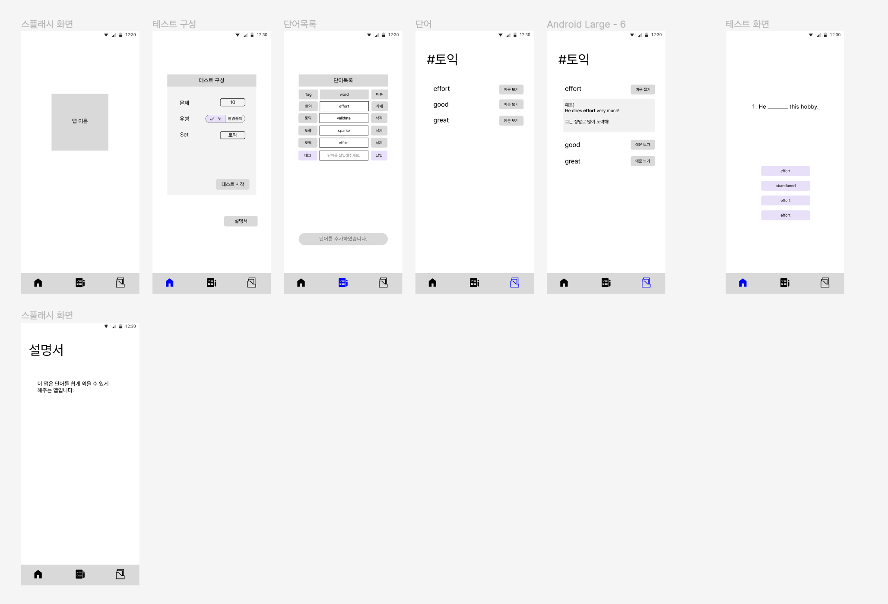

# 회의록_0514

### 일시

- 5월 14일 오후 8시 ~ 10시

### 참석자

- 김세창, 박상재, 채기웅, 탁채원

### 회의 주제

- 프로젝트 주제 선정

---

### 프로젝트 주제

- 쇼핑앱
- 커스텀 타이머
- 책 추천
- 영어 단어 암기 (+챗GPT)
    - 영어 단어 insert/delete하면 관련 예문 만들어서 보충 설명해주고, 문제 만들어주기
---

주제: GPT를 활용한 단어암기 어플리케이션

- 개요:
  - 원하는 단어만으로 단어장을 만들어서 공부할 수 있다.
  - 단어 암기가 쉽도록 GPT가 단어 문제를 만들어준다.

- 목표:
  - 개발 계획
  - 시간계획

- 기능 구성
  - 태그 기반 단어 입력 기능
  - 태그 기반으로 단어를 묶고, GPT 기반 단어 문제 제작 기능

- 메뉴 구성
  - 홈
  - 입력한 단어 목록보기
  - 퀴즈만들기(테스트 구성하기)
  - 랜덤구성
  - 태그를 선택해 테스트 구성
  - 오답노트
  - 즐겨찾기 보기

화면구성 예시

추가 기능
- 영어 지문 넣으면 지문 관련된 문제 제공 (+챗GPT)

---

### 다음 회의 안건

- 깃 설정
- 프로젝트 역할 분담
- 영어 암기 앱의 기능 세분화
